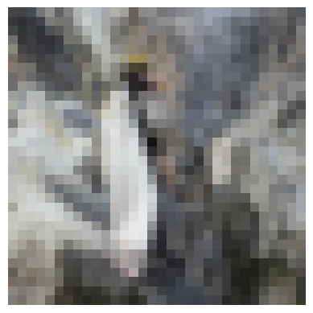
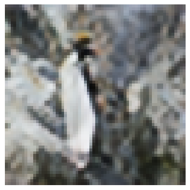
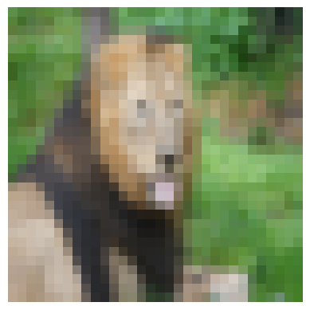
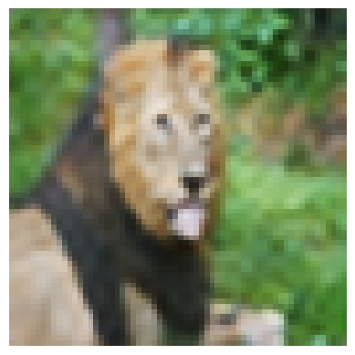

# 🚀 Results (Quick Preview)

> *See what it does first.*

| Low Resolution (32×32) | Super Resolution (64×64) |
|------------------------|--------------------------|
|    |      |
|    |      |

### ✅ Observations:
- Preserved **structure**
- Stable **color & brightness**
- Sharper **edges after GAN fine-tuning**

---

# 🧠 SRGAN from Scratch (PyTorch)

A **Super-Resolution GAN (SRGAN-style)** built from scratch using **PyTorch**, trained entirely under **CPU-only constraints**.

The focus of this project is **training stability, correctness, and reproducibility**, not just architecture complexity.

---

## 🎯 Key Highlights

- ⚙️ Built **from scratch**
- 🧠 Uses **curriculum learning (L1 → GAN)**
- 🧪 Debugged real-world **data pipeline failure**
- 💡 Designed for **stability on small datasets**
- 🖥️ Fully trained on **CPU**

---

## ⚙️ Model Overview

### Generator
- Upscales **32×32 → 64×64**
- Uses **ConvTranspose2d + refinement layers**
- Key idea: **refinement after upsampling**

### Discriminator
- Scalar output (not PatchGAN)
- More stable for **small datasets**

---

## 🧪 Training Strategy

### Phase 1 — L1 Pretraining
- Learns **structure, brightness, color**
- Produces smooth but correct outputs

### Phase 2 — GAN Fine-Tuning

L_G = L1 + λ · GAN_loss
λ = 1e-4


💡 *Pixel loss builds structure. GAN loss decorates it.*

---

## 📊 Dataset

- Dataset: **DIV2K**
- HR → resized to **64×64**
- LR → downsampled to **32×32**
- Normalized to **[-1, 1]**
- Subset: **120–300 images (CPU constraint)**

---

## ⚙️ Hyperparameters

- Optimizer: Adam  
- Learning rate: 2e-4  
- Batch size: 6  
- Epochs: ~75  
- Loss: BCEWithLogitsLoss  

---

## 🧠 Key Debugging Insight

A **single-character bug** in normalization caused silent failure:

```python
# Wrong
Normalize(mean=[0.5*3], std=[0.5]*3)

# Correct
Normalize(mean=[0.5]*3, std=[0.5]*3)
```
## 🔍 Lesson:

Always validate data ranges before debugging the model.

## 📈 Current Status
✅ Stable SRGAN pipeline
✅ Correct preprocessing
✅ Reproducible results

## 🚧 Next Steps
🔼 Scale to 128×128
🧠 Add perceptual loss (VGG)
⚡ Improve inference & logging

## 🤝 Connect

Open to collaborations in Deep Learning, AI, and Generative Models.
